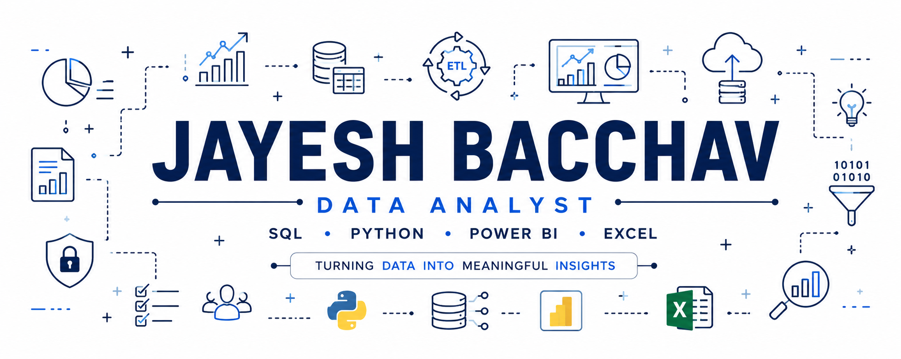

  

<h2 align="center">Hi 👋, I'm Jayesh Bacchav</h2>

<b>Data Analyst | AI & Data Science Graduate</b>

SQL • Python • Power BI • Excel

---

## 👨‍💻 About Me

I'm an Artificial Intelligence & Data Science graduate with a strong interest in **Data Analytics**, **Business Intelligence**, and **Data Engineering**.

I enjoy solving business problems using data and building practical projects with SQL, Python, Power BI, and Excel. My focus is on creating solutions that are easy to understand, useful for decision-making, and backed by real data.

Currently, I'm expanding my knowledge of modern data engineering tools while continuing to improve my analytics and problem-solving skills.

- 🎓 **B.E. in Artificial Intelligence & Data Science (2025)**
- 📍 **Pune, Maharashtra, India**
- 💼 **Open to Data Analyst, Business Analyst, and Junior Data Engineer opportunities**

---

## 💻 Tech Stack

### Languages
- SQL
- Python

### Analytics & Visualization
- Power BI
- Microsoft Excel
- Pandas
- NumPy

### Databases
- SQL Server
- MySQL

### Tools
- Git
- GitHub
- VS Code
- Jupyter Notebook

### Concepts
- Data Cleaning
- ETL
- Data Visualization
- Dashboard Development
- Business Analytics

---

## 🚀 Featured Projects

### 📊 Power BI Projects
Interactive dashboards built to analyze customer profitability, sales performance, and executive KPIs.

**Tech:** Power BI • DAX • Excel

🔗 Repository:  
https://github.com/Jayesh23B/PowerBI-projects

---

### 🗄️ HR Database SQL Project
Designed a relational HR database and solved real business scenarios using joins, CTEs, window functions, and ranking functions.

**Tech:** SQL Server • T-SQL

🔗 Repository:  
https://github.com/Jayesh23B/HR-Database-SQL-Project

---

### 🚚 Supply Chain SQL Project
SQL-based analysis of inventory, warehouse operations, suppliers, and sales trends.

**Tech:** SQL Server • T-SQL

🔗 Repository:  
https://github.com/Jayesh23B/Supply-Chain-SQL-project

---

### 💰 Financial Analysis Excel Project
Performed financial analysis using Pivot Tables, charts, and functions including IRR, XIRR, MIRR, NPV, and PV.

**Tech:** Microsoft Excel

🔗 Repository:  
https://github.com/Jayesh23B/Financial-Analysis-Excel-Project

---

### 🤖 Payment Intelligence System
An AI-powered financial assistant capable of intelligently selecting SQL retrieval or machine learning prediction based on user queries.

**Tech:** Python • SQL • Machine Learning

🔗 Repository:  
https://github.com/Jayesh23B/Payment-Intelligence-System

---

### 📄 RAG Financial Document System
A Retrieval-Augmented Generation application that performs semantic search across financial documents using FastAPI and FAISS.

**Tech:** Python • FastAPI • FAISS

🔗 Repository:  
https://github.com/Jayesh23B/rag-financial-doc-system

---

## 🌱 Currently Learning

- Advanced SQL
- Data Engineering
- Apache Airflow
- AWS Cloud

---

## 📈 GitHub

I use GitHub to document projects, practice new technologies, and continuously improve my technical skills by building practical, business-oriented solutions.

---

## 🤝 Let's Connect

📧 **Email**  
**jayeshbacchav9@gmail.com**

💼 **LinkedIn**  
**https://www.linkedin.com/in/jayeshbacchav9**

🌐 **Portfolio**  
**https://jayesh-portfolio-sandy.vercel.app**

🐙 **GitHub**  
**https://github.com/Jayesh23B**

---

Thanks for visiting my profile! ⭐  
I'm always open to learning, collaborating, and building impactful data-driven solutions.

